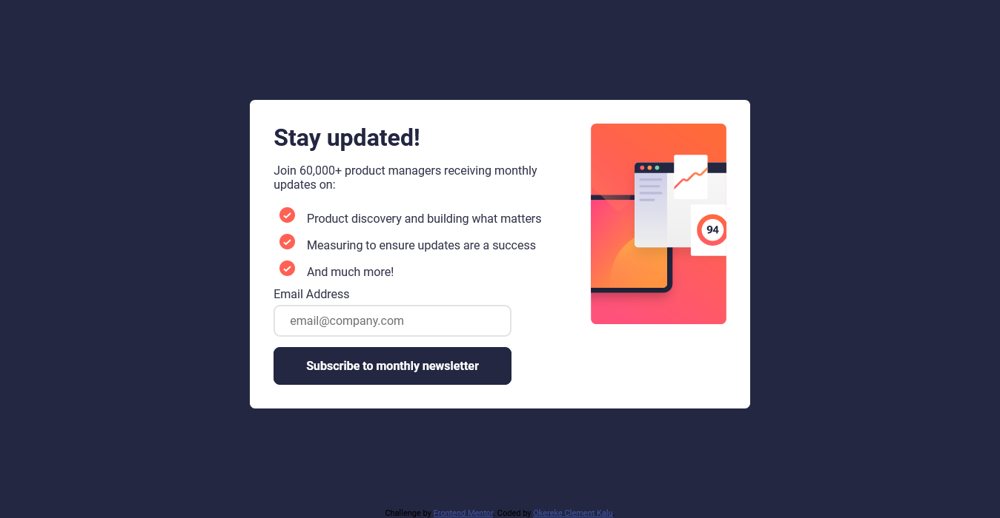

# Frontend Mentor - Newsletter sign-up form with success message solution

This is a solution to the [Newsletter sign-up form with success message challenge on Frontend Mentor](https://www.frontendmentor.io/challenges/newsletter-signup-form-with-success-message-3FC1AZbNrv). Frontend Mentor challenges help you improve your coding skills by building realistic projects.


## Table of contents

- [Overview](#overview)
  - [The challenge](#the-challenge)
  - [Screenshot](#screenshot)
  - [Links](#links)
- [My process](#my-process)
  - [Built with](#built-with)
  - [What I learned](#what-i-learned)
  - [Continued development](#continued-development)
  - [Useful resources](#useful-resources)
- [Author](#author)


## Overview

### The challenge

Users should be able to:

- Add their email and submit the form
- See a success message with their email after successfully submitting the form
- See form validation messages if:
  - The field is left empty
  - The email address is not formatted correctly
- View the optimal layout for the interface depending on their device's screen size
- See hover and focus states for all interactive elements on the page

### Screenshot



### Links

- Solution URL: [GitHub Link Url](https://github.com/inspikalu/newsletter-sign-up-with-success-message)
- Live Site URL: [Render Page Url](https://newsletter-sign-up-with-success-message-3yl4.onrender.com/)

## My process

### Built with

- Semantic HTML5 markup
- CSS custom properties
- Flexbox
- CSS Grid
- Mobile-first workflow


### What I learned

While building this project i learned how to work with and style the picture element.
I used the picture element to display various images based on the screen width.

```html
<picture class="card__rightSide">
         <source media="(min-width: 1001px )" srcset="/assets/images/illustration-sign-up-desktop.svg">
         <source media="(max-width: 1000px )" srcset="/assets/images/illustration-sign-up-mobile.svg">
        
</picture>
```
```sass
picture{
  display: block;
  width: 30%;
  height: auto;
  align-self: flex-start;

    img{
      width: 100%;
    }
}


```

### Continued development

While working on future projects, I'll love  improve my mobile first responsive web development
### Useful resources

- [HTML `<picture>` Element](https://www.w3schools.com/html/html_images_picture.asp) - This helped me for XYZ reason. I really liked this pattern and will use it going forward.

## Author

- Frontend Mentor - [@inspikalu](https://www.frontendmentor.io/profile/inspikalu)
- Twitter - [@inspikalu](https://www.twitter.com/inspikalu)
